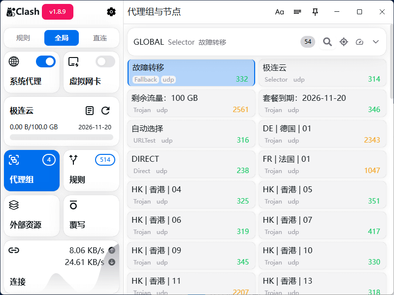

# 极连云 - *高速稳定的网络加速服务*

极连云(JiLianYun)告别卡顿与无法访问。极连云(JiLianYun)提供高速节点与可靠连接，轻松访问全球网站与内容。

## 什么是极连云？

极连云是一款专为国内用户打造的高速网络加速服务。无论是日常浏览、观看流媒体、跨境工作协作，还是访问 AI 工具，极连云都能提供流畅、稳定的连接体验。

全节点使用高质量专线，晚高峰依然保持高速；原生 IP 节点轻松解锁 Netflix、Disney+、ChatGPT 等服务。

支持 Windows、Mac、iOS、Android、Linux 等设备，一键导入订阅即可使用。

## 极连云功能优势

### ⚡ 极速连接体验

采用高质量专线，速度快、延迟低，打开网页、看视频更流畅。

### 🔒 安全加密保护

全程数据加密传输，让你的浏览与隐私更加安全。

### 🌍 全球节点覆盖

香港、日本、美国、英国、台湾、新加坡等多区域高速节点随时可用。

## 极连云订阅套餐

### 极连云 · L1 Basic

**¥15.50 / 月付**

适合轻度使用者：日常浏览、视频、社交、AI 查询。

- ✅ 每月 100G 流量
- ✅ 节点倍率 x1
- ✅ 晚高峰不降速
- ✅ 原生 IP 流媒体解锁
- ✅ 支持 ChatGPT / Claude
- ✅ 不限设备数量
- ✅ 全专线带宽，速率最高 2.5Gbps

*年付 8 折 · 2 年付 7 折 · 3 年付 6 折*

### 极连云 · L2 Pro

**¥30.50 / 月付**

适合中重度使用者：流媒体、跨境办公、长期留学、AI 依赖用户。

- ✅ 每月 200G 流量
- ✅ 全节点高速支持
- ✅ 晚高峰依然流畅
- ✅ 原生节点全解锁流媒体
- ✅ AI 服务百分百可用
- ✅ 支持高并发与远程办公

## 极连云机场测速

## 用户评价

### 林先生 · 跨境电商

每天都要连接海外后台，用了极连云后速度稳定，几乎不会掉线，比以前用的服务快很多。

### 小陈 · 留学生

主要用来看 Netflix 和 ChatGPT 做作业，晚上高峰也能看 4K，非常稳。

### Aki · 自媒体

上传视频和访问素材网站都很顺畅，已经从别家换到极连云半年了，体验优秀。

## 常见问题

**新手能用吗？难不难？**  
非常简单，一键导入订阅即可，全程不到 1 分钟。

**能看 Netflix / Disney+ 吗？**  
可以，极连云使用原生节点，流媒体轻松解锁。

**支持哪些设备？**  
Windows / Mac / iOS / Android / Linux 全平台支持。

**会不会掉线？会限速吗？**  
不会。全线采用高质量专线，不降速、不掉线。

**能用 ChatGPT 和其他 AI 服务吗？**  
可以，ChatGPT、Claude、Gemini、Midjourney 全支持。

> **极连云** - 快速稳定的网络加速服务：访问 [官网](https://jilianyun.org) 订阅。
